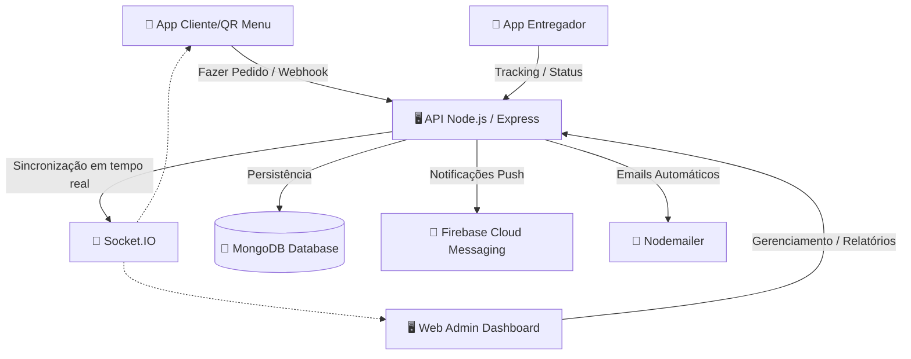

# 🍽️ Plataforma Inteligente de Gestão de Restaurantes (QR Menu)
## Documentação Completa do Sistema

Este documento descreve detalhadamente a arquitetura, as funcionalidades, o modelo comercial e as inovações técnicas da **Plataforma Integrada de Gestão de Restaurantes (QR Menu)**. O sistema foi projetado sob os mais modernos padrões de engenharia de software e experiência do usuário (UX), focado em eficiência operacional, otimização de vendas e automatização de processos para estabelecimentos como restaurantes, bares, lanchonetes e pizzarias.

---

## 📌 1. Visão Geral e Objetivos do Sistema

O sistema vai muito além de um simples menu digital via QR Code. Trata-se de uma **central completa de controlo, crescimento e lucro** que integra toda a cadeia de atendimento de um restaurante em tempo real: desde o cliente na mesa até à cozinha, atendentes, gestores e serviço de entrega (*delivery*).

### Objetivos Principais:
1. **Redução de Fricção no Atendimento:** Eliminar tempos mortos de espera e reduzir erros de comunicação em pedidos.
2. **Ciclo de Vida Automatizado de Mesas:** Controlar transições automáticas de status das mesas (Livre ➔ Ocupada ➔ Atendimento ➔ Pagamento ➔ Limpeza).
3. **Gestão Operacional Baseada em Dados:** Prover painéis estatísticos (*dashboards*) e relatórios automáticos que transformam dados de vendas, estoque e desempenho em decisões de negócios.
4. **Monetização e Comercialização (Modelo SaaS):** Estrutura de cobrança recorrente automatizada integrada com provedores de pagamentos locais para operar como um software como serviço (SaaS) escalável.

---

## 🛠️ 2. Arquitetura e Stack Tecnológica

O sistema utiliza uma arquitetura baseada em microsserviços e comunicação bidirecional em tempo real para sincronização instantânea de pedidos e alertas operacionais.



### Backend (API)
- **Ambiente de Execução:** Node.js v18+
- **Framework Web:** Express.js
- **Banco de Dados:** MongoDB (com Mongoose ODM)
- **Comunicação em Tempo Real:** Socket.IO
- **Notificações Push:** Firebase Admin SDK (FCM)
- **Envio de Emails:** Nodemailer (SMTP)
- **Agendamento de Tarefas:** `node-cron` (para faturamento e suspensão de subscrições)
- **Segurança:** Autenticação via JSON Web Tokens (JWT) e criptografia de senhas com bcrypt.

### Frontend
- **Aplicativos Móveis:** React Native com Expo (Cliente e Entregadores)
- **Dashboard Web de Administração:** React.js com Vite, estruturado com Tailwind CSS e componentes dinâmicos.
- **Internacionalização (i18n):** Suporte multilíngue em 4 idiomas (Português, Inglês, Espanhol e Francês).

---

## 👥 3. Módulos do Sistema e Perfis de Usuários

O sistema possui uma matriz de controle de acessos (RBAC) com permissões específicas para os seguintes perfis:

### A. Para Clientes (Consumidor Final)
*   **Acesso Simplificado:** Leitura de código QR na mesa, sem necessidade de baixar um app.
*   **Menu Interativo:** Navegação fluida por categorias com fotos profissionais, descrições detalhadas e cálculo de taxas automático.
*   **Customização de Pedidos:** Seleção de modificadores e extras (ex.: tamanho de pizza, ponto da carne, ingredientes extras).
*   **Pedido Direto:** Envio do pedido diretamente à cozinha sem precisar chamar o garçom.
*   **Chamada Operacional:** Botões digitais na tela para chamar o garçom, solicitar a conta ou pedir limpeza da mesa.
*   **Pagamentos Digitais Integrados:** Suporte a pagamentos locais (M-Pesa, e-Mola, BIM, BCI) e dinheiro.
*   **Feedback Expresso:** Sistema de avaliação instantânea da experiência baseado em 5 emoções (Emojis animados).

### B. Para Garçons / Atendentes (*Waiters*)
*   **Interface Mobile-First:** Dashboard no smartphone otimizado para fluxo de trabalho dinâmico.
*   **Visualização de Alertas:** Notificações em tempo real (sonoras e de vibração) quando novos pedidos são feitos ou quando clientes chamam atendimento.
*   **SLA por Mesa:** Monitoramento visual de quanto tempo cada mesa está aguardando atendimento.

### C. Para a Cozinha (*Kitchen*)
*   **Painel da Cozinha:** Interface adaptada para tablets/monitores (Tema Escuro de alto contraste) que organiza a fila de preparo.
*   **Controle de Estados:** Transições de pedidos (⏳ Pendente ➔ Confirme ➔ Em Preparação ➔ Pronto para Servir).
*   **Alertas Visuais:** Indicação de prioridade e atraso de pratos baseada no SLA programado.

### D. Para Gestores (*Managers*)
*   **Controle Operacional:** Abertura e fechamento de turnos, atribuição de garçons às mesas, gerenciamento do cardápio e cupons de desconto.
*   **Visão em Tempo Real:** Mapa de mesas visual interativo com estados dinâmicos e alertas urgentes.

### E. Para Proprietários (*Owners*)
*   **Dashboard Executivo (Multi-Restaurante):** Visão centralizada de faturamento, ticket médio, lucros estimados e crescimento percentual de todas as filiais.
*   **Administração Financeira:** Gestão de subscrições do sistema por restaurante e faturamento centralizado.

---

## 📈 4. Modelo Comercial, Subscrições e Vendas

Projetado especificamente com foco na realidade e viabilidade comercial do mercado de **Moçambique (MZ)**, o sistema utiliza uma abordagem híbrida de custos baixos de entrada com mensalidades escaláveis.

### A. Estrutura de Planos e Preços

O produto é comercializado em três pacotes modulares:

| Funcionalidades | 🟢 Starter (Essencial) | 🔵 Pro (Profissional) | 🟣 Premium (Inteligente) |
| :--- | :---: | :---: | :---: |
| **Cardápio Digital QR Code** | ✅ Sim | ✅ Sim | ✅ Sim |
| **Pedidos Diretos da Mesa** | ✅ Sim | ✅ Sim | ✅ Sim |
| **Pagamentos Integrados (M-Pesa/e-Mola)** | ✅ Sim | ✅ Sim | ✅ Sim |
| **Relatórios Básicos** | ✅ Sim | ✅ Sim | ✅ Sim |
| **Gestão de Usuários (Staff)** | Básico (Garçom/Cozinha) | Avançado (Gerentes) | Multi-filial & Permissões |
| **SLA de Tempo por Mesa** | ❌ Não | ✅ Sim | ✅ Sim |
| **Notificações de Som/Vibração** | ❌ Não | ✅ Sim | ✅ Sim |
| **Ranking de Garçons** | ❌ Não | ✅ Sim | ✅ Sim |
| **Gestão de Estoque Completa** | ❌ Não | Básico | Avançado |
| **IA de Priorização de Mesas** | ❌ Não | ❌ Não | ✅ Sim |
| **BI e Análise Preditiva de Vendas** | ❌ Não | ❌ Não | ✅ Sim |
| **Suporte Técnico** | Standard | WhatsApp Dedicado | Prioritário 24/7 |
| **Preço de Setup Inicial (MZ)** | **100k - 250k MZN** | **300k - 500k MZN** | **600k+ MZN** |
| **Preço de Mensalidade (MZ)** | **8k - 15k MZN/mês** | **20k - 35k MZN/mês** | **40k - 70k MZN/mês** |

### B. Gestão de Cobrança e Regras de Negócio do SaaS
A plataforma gerencia de forma automatizada o ciclo de vida financeiro de cada restaurante cliente:
*   **Período de Experiência:** 30 dias de trial gratuito para novos cadastros (Setup isento na promoção de lançamento).
*   **Ciclo de Faturamento:** Cobrança recorrente mensal no valor estabelecido pelo plano.
*   **Régua de Comunicação por Email:** Notificações de expiração enviadas 7 dias, 3 dias e 1 dia antes do vencimento.
*   **Período de Tolerância (*Grace Period*):** 3 dias após a data de vencimento.
*   **Bloqueio e Suspensão:** Suspensão automática do acesso ao dashboard operacional e suspensão do menu QR Code após o período de tolerância em caso de falta de pagamento.

---

## 🧠 5. Funcionalidades Avançadas e Engenharia de UX

O sistema implementa melhorias de usabilidade inspiradas nas maiores plataformas globais de restauração (como Toast e Lightspeed):

### 1. Gestão de Sessões de Mesas (*Table Session Management*)
Ao invés de apenas gerenciar pedidos soltos, o sistema gerencia **Sessões de Ocupação**. 
*   Quando o cliente escaneia o QR Code de uma mesa livre e realiza o primeiro pedido, a API cria automaticamente um registro de `TableSession` e altera o status da mesa para `occupied` (Ocupada).
*   Todos os pedidos subsequentes feitos a partir daquela mesa são associados à sessão ativa.
*   Ao final, um gerente ou garçom encerra a sessão (ação de liberar mesa). O sistema calcula o faturamento total da sessão, fecha todos os pedidos e registra estatísticas de permanência e ticket médio antes de alterar a mesa para `free` (Livre).

### 2. Algoritmo Heurístico de Priorização de Mesas (Inteligência Artificial)
O sistema avalia dinamicamente e classifica as mesas em tempo real, informando aos garçons quais mesas requerem atenção urgente. A classificação gera uma pontuação de risco (*Score*):
*   **Presença de pratos prontos esperando serviço:** +100 pontos
*   **Mesa esperando atendimento há mais de 30 min:** +80 pontos
*   **Mesa esperando atendimento há mais de 15 min:** +50 pontos
*   **Mesa com muitos pedidos simultâneos (>=3):** +30 pontos
*   **Mesas com grande capacidade (Mesa VIP / Família >= 6 pessoas):** +20 pontos

A pontuação categoriza a mesa visualmente:
*   🔴 **Alta Prioridade (Score >= 80):** Mesa necessita de intervenção urgente (alerta piscando em vermelho).
*   🟠 **Prioridade Média (Score 30 - 79):** Atenção necessária.
*   🟢 **Normal (Score < 30):** Operação fluindo normalmente.

### 3. SLA Dinâmico de Atendimento
Um contador visual exibe em tempo real o tempo decorrido desde a abertura da sessão ou do último pedido.
*   Abaixo de 7 minutos: Status Verde.
*   Entre 7 e 10 minutos: Status Amarelo (Atenção).
*   Acima de 10 minutos: Status Vermelho (Alerta de SLA Estourado).

### 4. Notificações Inteligentes
*   **Vibração Mobile:** Utiliza a API `navigator.vibrate` nos smartphones dos garçons (Android) para emitir vibrações padrões discretas ao receber novos alertas.
*   **Som Dinâmico:** Notificações de som contínuo ou pontual para novos pedidos na cozinha, garantindo que o staff escute mesmo em ambientes ruidosos.

---

## 📊 6. Dashboards Visuais e Relatórios Analíticos

Para suportar a tomada de decisão em todos os níveis, a plataforma conta com uma robusta estrutura de dados exportáveis em PDF, Excel ou CSV.

### A. Dashboards Especializados
1.  **Dono (Executivo / Multi-Restaurante):** Cards de KPI de Receita total, Crescimento percentual comparativo, Ticket médio e gráficos de tendência.
2.  **Gerente (Operacional):** Pedidos ativos hoje, tempo médio de atendimento, mapa gráfico do status das mesas e alertas de SLA.
3.  **Cozinha (Monitor):** Fila de pedidos de alto contraste otimizada para o calor e iluminação da cozinha, exibindo ordem de chegada dos pratos.
4.  **Clientes & Experiência:** Gráficos acumulados do índice de satisfação geral (Emoji Ratio).

### B. Relatórios Estratégicos
*   **Financeiro Geral:** Crescimento contra períodos anteriores e margens brutas.
*   **Vendas por Categoria:** Pratos mais vendidos vs. pratos frios, ajudando a ajustar o menu e promoções.
*   **Desempenho da Equipe:** Tempo médio de resposta de cada atendente e número de pedidos atendidos, servindo de base para bônus e rankings internos.
*   **Estoque e Custos:** Alertas de produtos próximos ao limite de ruptura e margem líquida por prato com base no custo de insumos.

---

## 🔐 7. Segurança, Permissões e Auditoria

A API implementa middlewares de segurança rígidos para garantir a integridade dos dados e impedir ações não autorizadas:

```javascript
// Exemplo de aplicação prática de controle de acessos nas rotas da API
router.post('/tables/:id/free', 
  authenticateToken,  // Valida o JSON Web Token do usuário
  canFreeTable,       // Middleware que garante que apenas 'owner', 'manager' ou 'waiter' podem liberar mesas
  freeTableController // Executa a lógica de encerramento de sessão da mesa
);
```

### Registros de Auditoria (Logs)
Cada alteração crítica no sistema (cancelamento de pedidos, alteração de preços do menu, fechamento manual de mesas, estornos) gera um log de auditoria registrando o ID do usuário responsável, timestamp exato e valores alterados, assegurando total rastreabilidade financeira contra fraudes internas.

---

## 📞 8. Desenvolvimento, Suporte e Contactos (Nhiquela)

A plataforma é desenvolvida, licenciada e suportada pela **Nhiquela Serviços e Consultoria, LDA**, uma empresa moçambicana de direito privado dedicada ao desenvolvimento de soluções tecnológicas premium, desenhadas à medida do mercado regional e internacional.

*   **Website Oficial:** [www.nhiquelaservicos.com](🌐 http://www.nhiquelaservicos.com)
*   **E-mail de Contacto:** [nhiquelaservicos@gmail.com](mailto:nhiquelaservicos@gmail.com)
*   **WhatsApp / Telefone:** +258 853 600 036
*   **Escritório / Sede:** Malhangalene – Maputo, Moçambique

